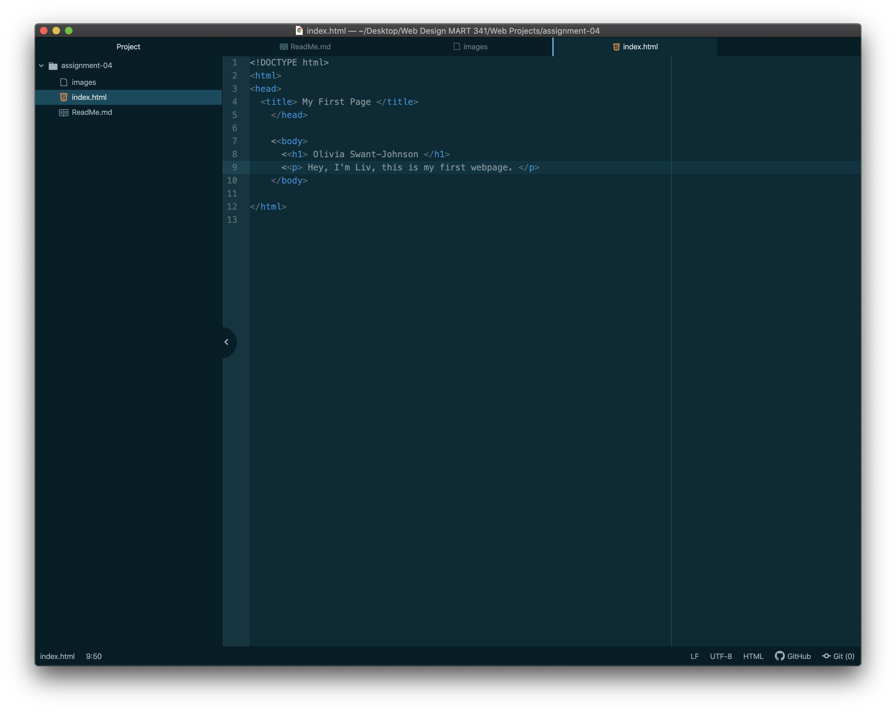

1. Browsers are software that send requests from your device to servers and then interpret the response. I pretty much just use chrome.
2. Markup language provides the basic structure of a website- the headings and the paragraphs and the images, etc. HTML, or Hypertext Markup Language, is a really common markup language that provides the basic building blocks of website. It's like the frame of the house. Other ?languages? can be added on to a basic HTML structure, like CSS or javascript, to customize it and make it function properly.

